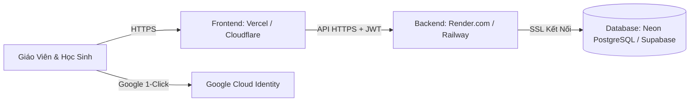

# Hướng Dẫn Triển Khai TeachTool Lên Mạng (Miễn Phí 100% & Bảo Mật Cao)

Tài liệu này hướng dẫn chi tiết cách đưa hệ thống **TeachTool** lên Internet để giáo viên và học sinh ở bất kỳ đâu đều có thể truy cập qua điện thoại và máy tính, sử dụng các nền tảng đám mây **uy tín hàng đầu thế giới với gói Miễn Phí vĩnh viễn (Free Tier)**.

---

## Tóm Tắt Kiến Trúc Triển Khai



1. **Database**: **Neon.tech** hoặc **Supabase** (PostgreSQL Serverless, hỗ trợ mã hóa SSL/TLS, tự động sao lưu, miễn phí 0đ).
2. **Backend**: **Render.com** (Web Service chạy container Docker Spring Boot, tự động cấp chứng chỉ HTTPS, miễn phí 0đ).
3. **Frontend**: **Vercel** (Hosting ứng dụng React Vite, phân phối qua mạng CDN toàn cầu siêu nhanh, HTTPS mặc định, miễn phí 0đ).
4. **Xác thực Google**: **Google Cloud Console** (OAuth 2.0 Client ID, miễn phí 0đ).

---

## BƯỚC 1: Lấy Google Client ID Để Xác Thực Gmail Thật 100% (3 Phút)

1. Truy cập vào [Google Cloud Console](https://console.cloud.google.com/) và đăng nhập bằng tài khoản Google của bạn.
2. Bấm vào menu chọn dự án ở góc trên bên trái -> Chọn **New Project (Dự án mới)** -> Đặt tên: `TeachTool` -> Bấm **Create**.
3. Tại thanh tìm kiếm trên cùng, gõ **APIs & Services** -> Chọn **OAuth consent screen (Màn hình đồng ý OAuth)**:
   - Chọn loại: **External (Bên ngoài)** -> Bấm **Create**.
   - Điền thông tin:
     - *App name*: `TeachTool`
     - *User support email*: Chọn email của bạn.
     - *Developer contact information*: Điền email của bạn.
   - Bấm **Save and Continue** qua các bước tiếp theo cho đến khi hoàn thành.
4. Chuyển sang thẻ **Credentials (Thông tin xác thực)** bên menu trái:
   - Bấm nút **+ CREATE CREDENTIALS** -> Chọn **OAuth client ID**.
   - Mục *Application type*: Chọn **Web application**.
   - Mục *Name*: Đặt tên `TeachTool Web Client`.
   - Mục **Authorized JavaScript origins**:
     - Thêm `http://localhost:5173` (cho máy bạn dùng thử).
     - Thêm link trang web Vercel của bạn sau khi tạo (ví dụ: `https://teachtool.vercel.app`).
5. Bấm **Create** -> Google sẽ hiện popup chứa **Client ID** (dãy ký tự dạng: `xxxxxxxxxxxx-xxxxxxxxxxxxxxxx.apps.googleusercontent.com`).
6. Dán mã này vào file `edu-frontend/.env`:
   ```env
   VITE_GOOGLE_CLIENT_ID=xxxxxxxxxxxx-xxxxxxxxxxxxxxxx.apps.googleusercontent.com
   ```

---

## BƯỚC 2: Tạo Cơ Sở Dữ Liệu PostgreSQL Miễn Phí Trên Neon.tech (2 Phút)

1. Truy cập [https://neon.tech](https://neon.tech) và đăng ký tài khoản miễn phí bằng tài khoản GitHub hoặc Google.
2. Bấm **Create Project** -> Đặt tên dự án: `teachtool-db` -> Chọn vùng gần Việt Nam (ví dụ: `Singapore` hoặc `Asia`).
3. Neon sẽ hiển thị chuỗi kết nối **Connection Details**:
   - Chọn định dạng: **Spring Boot** hoặc xem thông số:
     - **Host**: `ep-xxxx.ap-southeast-1.neon.tech`
     - **Database**: `neondb`
     - **Username**: `neondb_owner`
     - **Password**: `xxxxxxxxxxxx`
4. Lưu lại chuỗi JDBC URL có dạng:
   ```text
   jdbc:postgresql://ep-xxxx.ap-southeast-1.neon.tech/neondb?sslmode=require
   ```

---

## BƯỚC 3: Triển Khai Backend Lên Render.com (Miễn Phí)

1. Đẩy mã nguồn toàn bộ thư mục dự án lên một kho lưu trữ riêng trên [GitHub](https://github.com/) của bạn (chế độ Private để bảo vệ mã nguồn).
2. Truy cập [https://render.com](https://render.com) và đăng nhập bằng tài khoản GitHub.
3. Bấm nút **New +** -> Chọn **Web Service**.
4. Chọn kết nối với kho GitHub `TEACHTOOL` vừa tải lên:
   - **Name**: `teachtool-api`
   - **Region**: `Singapore`
   - **Language / Environment**: `Docker`
   - **Dockerfile Path**: `api/Dockerfile`
   - **Docker Build Context**: `api`
   - **Instance Type**: `Free`
5. Cuộn xuống mục **Environment Variables (Biến môi trường)** và thêm các khóa sau:
   - `SPRING_DATASOURCE_URL`: Dán chuỗi JDBC của Neon ở Bước 2.
   - `SPRING_DATASOURCE_USERNAME`: Tên user của Neon.
   - `SPRING_DATASOURCE_PASSWORD`: Mật khẩu của Neon.
   - `APP_JWT_SECRET`: Nhập một chuỗi ký tự ngẫu nhiên dài từ 32 ký tự (để ký token bảo mật).
   - `APP_GOOGLE_CLIENT_ID`: Dán Google Client ID lấy được ở Bước 1.
   - `APP_CORS_ALLOWED_ORIGINS`: Dán link frontend của bạn (sẽ có ở Bước 4, tạm thời để `*` hoặc `https://teachtool.vercel.app`).
6. Bấm **Deploy Web Service**.
   - Render sẽ tự động chạy Docker đóng gói Spring Boot và cấp cho bạn một đường dẫn API HTTPS an toàn miễn phí:
     `https://teachtool-api-xxxx.onrender.com`

---

## BƯỚC 4: Triển Khai Frontend React Lên Vercel (1 Phút)

1. Truy cập [https://vercel.com](https://vercel.com) và đăng nhập bằng tài khoản GitHub.
2. Bấm **Add New...** -> Chọn **Project** -> Chọn kho GitHub `TEACHTOOL`.
3. Cấu hình triển khai:
   - **Root Directory**: Bấm Edit và chọn thư mục `edu-frontend`.
   - **Framework Preset**: Chọn `Vite` (Vercel tự động nhận diện).
4. Mở rộng mục **Environment Variables**:
   - Khóa: `VITE_API_URL` -> Giá trị: `https://teachtool-api-xxxx.onrender.com/api` (Link Render ở Bước 3).
   - Khóa: `VITE_GOOGLE_CLIENT_ID` -> Giá trị: Dán Google Client ID ở Bước 1.
5. Bấm **Deploy**:
   - Vercel sẽ biên dịch mã và cung cấp cho bạn một tên miền HTTPS chính thức: ví dụ `https://teachtool.vercel.app`.
   - Trang web lúc này đã hoạt động trực tuyến 100%!

---

## BƯỚC 5: Kiểm Tra Bảo Mật & Hoàn Tất

1. Mở link web trên điện thoại và máy tính.
2. Thử bấm **"Đăng nhập bằng Google"**: Cửa sổ Google chính thức sẽ hiện ra, học sinh và giáo viên chọn tài khoản Gmail thật là có thể vào ngay!
3. Thử đăng ký tài khoản mới bằng Email + Mật khẩu: Mật khẩu được mã hóa an toàn bằng thuật toán PBKDF2 với Salt, token bảo mật JWT có hiệu lực 7 ngày.
4. Mọi kết nối truyền qua mạng đều được mã hóa bằng giao thức **HTTPS / SSL 256-bit** chuẩn quốc tế.
